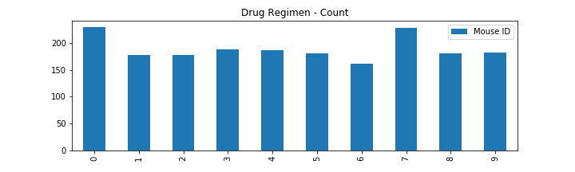
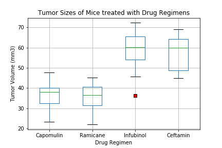
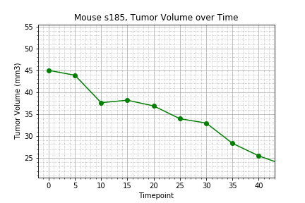
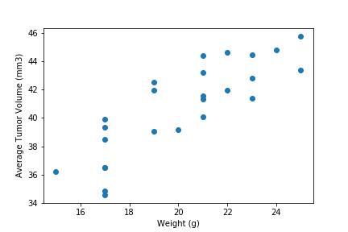
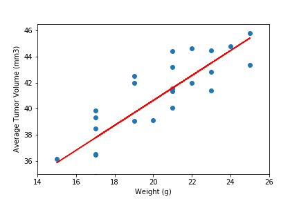

# Pharmaceutical Data Visualization | Matplotlib

## Table of Contents
* [Objective](#Objective)
* [Observations](#Observations)
* [Technologies](#Technologies)
* [Process](#Process)
* [Visualization](#Visualization)
* [Troubleshooting](#Troubleshooting)


# Objective
Provide a top-level summary of the study results, generating tables and figures to tell the story.

## Background

Pymaceuticals Inc., a burgeoning pharmaceutical company based out of San Diego, specializes in anti-cancer pharmaceuticals. In its most recent efforts, it began screening for potential treatments for squamous cell carcinoma (SCC), a commonly occurring form of skin cancer.

Their most recent animal study contains data on 250 mice identified with SCC tumor growth.  The mice were treated through a variety of drug regimens. Over the course of 45 days, tumor development was observed and measured. The purpose of this study was to compare the performance of Pymaceuticals' drug of interest, Capomulin, versus the other treatment regimens. 

# Observations
* Capomulin outformed the placebo as well as Infubinol, Ketapril in tumor volume reduction, survival rate, and lower metastatic site occurences. It was the only treatment out of the 4 reported that consistently saw average tumor size decrease over the 45 day treatment. The average tumor size decreased overall as well. The average number of metastatic sites was nearly 1.75 sites lower than the placebo group and the Ketapril group. Capomulin also saw substantially higher survival rates over the course of 45 days. They were the only group with a final survival rate of over 50% and a survival rate 37.5% higher than any other group.

* The Ketapril group saw an average growth of about 5.7% higher than the placebo group. This may or may not be statistically significant. The Ketapril group saw a slower average increase in metastatic sites than the Placebo group during the course of the 45 days, but overall the number of metatastic sites were about the same. Ketapril's surival rates are comparable to the placebo at the end of the 45 day treatment.

* The average Infubinal group tumor growth was similar to that of the placebo group, but the average increase in metastatic sites was lower over the course of treatment. This group experienced average growth in metastatic sites, higher than Capomulin. The Infubinal group, however, experienced the lowest surival rates of the two other treatments and the placebo.

# Technologies
* Python 
* Pandas
* Matplotlib

# Process
* Generate a summary statistics table consisting of the mean, median, variance, standard deviation, and SEM of the tumor volume for each drug regimen.
```
summarystats = pd.DataFrame(study_data.groupby("Drug Regimen").count())
#Use groupby to create summary stats by drug regime, add results into columns in summarystats

summarystats["Mean"] = pd.DataFrame(study_data.groupby("Drug Regimen")["Tumor Volume (mm3)"].mean())
summarystats["Median"] = pd.DataFrame(study_data.groupby("Drug Regimen")["Tumor Volume (mm3)"].median())
summarystats["Standard Deviation"] = pd.DataFrame(study_data.groupby("Drug Regimen")["Tumor Volume (mm3)"].std())
summarystats["Variance"] = pd.DataFrame(study_data.groupby("Drug Regimen")["Tumor Volume (mm3)"].var())
summarystats["SEM"] = pd.DataFrame(study_data.groupby("Drug Regimen")["Tumor Volume (mm3)"].sem())

#Clean up columns, just keeping a count column for some of the graphs below
summarystats = summarystats[["Mouse ID", "Mean", "Median", "Standard Deviation", "Variance", "SEM"]]

#Rename count column
summarystats = summarystats.rename(columns = {"Mouse ID" : "Trials"})

summarystats.head()
```

* Generate a bar plot using both Pandas's `DataFrame.plot()` and Matplotlib's `pyplot` that shows the number of data points for each treatment regimen.
```
table_df = pd.DataFrame(study_data.groupby(["Drug Regimen"]).count()).reset_index()

datapoints = table_df[["Drug Regimen", "Mouse ID"]]
datapoints.plot(kind="bar",figsize=(10,3))
plt.title("Drug Regimen - Count")
plt.savefig('DrugRegimenCount.png')
plt.show()
```

* Generate a pie plot using both Pandas's `DataFrame.plot()` and Matplotlib's `pyplot` that shows the distribution of female or male mice in the study.
```{pandas}
gender_df=pd.DataFrame(study_data.groupby(["Sex"],).count()).reset_index()
gender_df = gender_df[["Sex","Mouse ID"]]
gender_df = gender_df.rename(columns={"Mouse ID": "Count"})
plt.show()
```
```{pyplot}
plt.figure(figsize=(10,6))
ax1 = plt.subplot(121, aspect='equal')
gender_df.plot(kind='pie', y = "Count", ax=ax1, autopct='%1.1f%%', 
 startangle=85, shadow=True, labels=gender_df['Sex'], legend = False, fontsize=12)
plt.savefig('Mice by Gender')
```

* Calculate the final tumor volume of each mouse across four of the most promising treatment regimens: Capomulin, Ramicane, Infubinol, and Ceftamin. Calculate the quartiles and IQR and quantitatively determine if there are any potential outliers across all four treatment regimens.
```
max_timepoint_df = study_data.loc[study_data.groupby("Mouse ID").Timepoint.idxmax()]
drug_list = ["Capomulin", "Ramicane", "Infubinol", "Ceftamin"]


for drug in drug_list:
    drug_df = max_timepoint_df[max_timepoint_df["Drug Regimen"] == drug]

    quartiles = drug_df["Tumor Volume (mm3)"].quantile([.25,.5,.75])
    lowerq = quartiles[0.25]
    upperq = quartiles[0.75]
    iqr = upperq-lowerq

    print(f"The lower quartile of {drug} is: {lowerq}")
    print(f"The upper quartile of {drug} is: {upperq}")
    print(f"The interquartile range of {drug} is: {iqr}")

    lower_bound = lowerq - (1.5*iqr)
    upper_bound = upperq + (1.5*iqr)
    print(f"Values below {lower_bound} could be outliers")
    print(f"Values above {upper_bound} could be outliers")
    
    min_tumor = drug_df["Tumor Volume (mm3)"].min()
    max_tumor = drug_df["Tumor Volume (mm3)"].max()
    
    print(f"The smallest tumor of {drug} is: {min_tumor}")
    print(f"The largest tumor of {drug} is: {max_tumor}")
    
    if min_tumor < lower_bound or max_tumor > upper_bound:
        print(f"***There is an outlier for {drug}.***")
    print("\n-------------------------------------------------------------\n")
```
* Using Matplotlib, generate a box and whisker plot of the final tumor volume for all four treatment regimens and highlight any potential outliers in the plot by changing their color and style.
```
drug_dict = {}

for drug in drug_list:
    drug_df = max_timepoint_df[max_timepoint_df["Drug Regimen"] == drug]
    
    drug_dict[drug] = drug_df["Tumor Volume (mm3)"].values

box_plot_df = pd.DataFrame(drug_dict)
red_square = dict(markerfacecolor='r', marker='s')
box_plot = box_plot_df.boxplot(flierprops=red_square)
box_plot.set_title("Tumor Sizes of Mice treated with Drug Regimens")
box_plot.set_ylabel("Tumor Volume (mm3)")
box_plot.set_xlabel("Drug Regimen")
plt.savefig("box_plot.png")
```

* Generate a line plot of time point versus tumor volume for a single mouse treated with Capomulin.
```
mouse_df = study_results.groupby("Mouse ID")
mouse_s185 = study_results[study_results["Mouse ID"] == "s185"]

x_axis = mouse_s185["Timepoint"]
y_axis = mouse_s185["Tumor Volume (mm3)"]

plt.plot(x_axis, y_axis, marker ='o', color='green')
plt.xlabel("Timepoint")
plt.ylabel("Tumor Volume (mm3)")
plt.title("Mouse s185, Tumor Volume over Time")
plt.ylim(20.5, 55.5)
plt.xlim(-2, 43)
plt.minorticks_on()
plt.grid(which='major', linestyle='-')
plt.grid(which='minor', linestyle=':')
plt.savefig("line_plot.png")
```

* Generate a scatter plot of mouse weight versus average tumor volume for the Capomulin treatment regimen.
```
capomulin_df = study_data.loc[study_data["Drug Regimen"] == "Capomulin",:]
capomulin_avg_df = capomulin_df.groupby(['Mouse ID']).mean()

plt.scatter(capomulin_avg_df['Weight (g)'],capomulin_avg_df['Tumor Volume (mm3)'])
plt.xlabel('Weight (g)')
plt.ylabel('Average Tumor Volume (mm3)')

plt.savefig('Avg Tumor Vol vs Weight-Capomulin')
plt.show()
plt.savefig("scatter_plot.png")
```

* Calculate the correlation coefficient and linear regression model between mouse weight and average tumor volume for the Capomulin treatment. Plot the linear regression model on top of the previous scatter plot.
```
corr=round(st.pearsonr(capomulin_avg_df['Weight (g)'],capomulin_avg_df['Tumor Volume (mm3)'])[0],2)
print(f"The correlation between mouse weight and average tumor volume is {corr}")

# Add the linear regression equation and line to plot
x_values = capomulin_avg_df['Weight (g)']
y_values = capomulin_avg_df['Tumor Volume (mm3)']
(slope, intercept, rvalue, pvalue, stderr) = st.linregress(x_values, y_values)
regress_values = x_values * slope + intercept
line_eq = "y = " + str(round(slope,2)) + "x + " + str(round(intercept,2))
plt.scatter(x_values,y_values)
plt.plot(x_values,regress_values,"r-")
plt.annotate(line_eq,(6,10),fontsize=15,color="red")
plt.xlabel('Weight (g)')
plt.ylabel('Average Tumor Volume (mm3)')

plt.ylim(35, 46.5)
plt.xlim(14, 26)

# Print out the r-squared value along with the plot.
print(f"The r-squared is: {rvalue}")
plt.savefig('Avg Tumor Vol vs Weight-Capomulin w regression')
plt.show()
plt.savefig("linear_regression_plot.png")
```

# Visualization












# Troubleshooting

  * How does my DataFrame need to be structured for me to have the right _x_-axis and _y_-axis?

  * How do I build a basic scatter plot?

  * How do I add a label to that scatter plot?

  * Where would the labels for that scatter plot come from?
